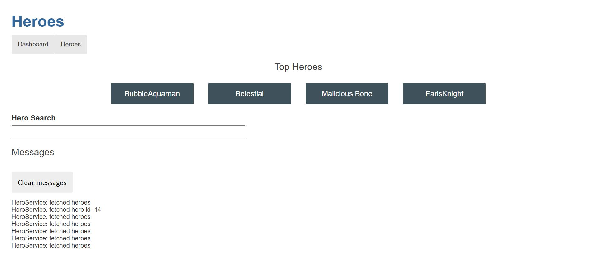
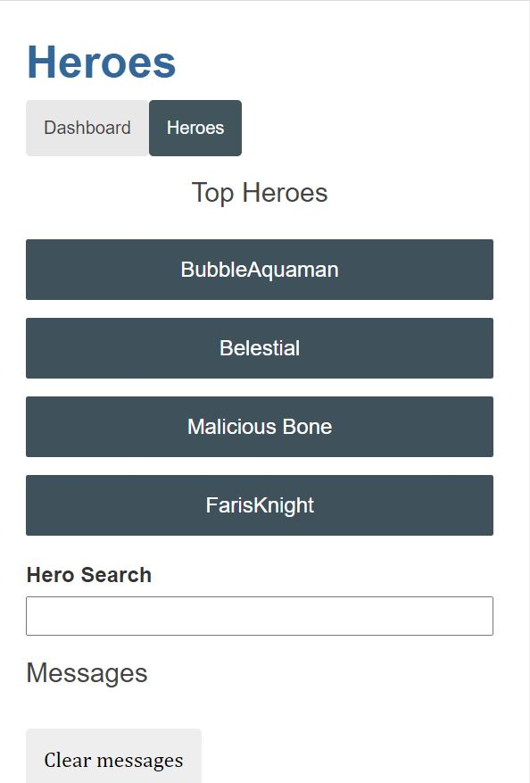
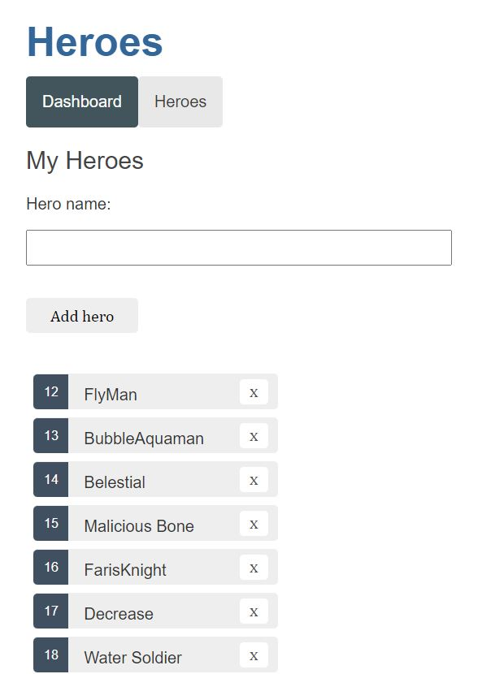
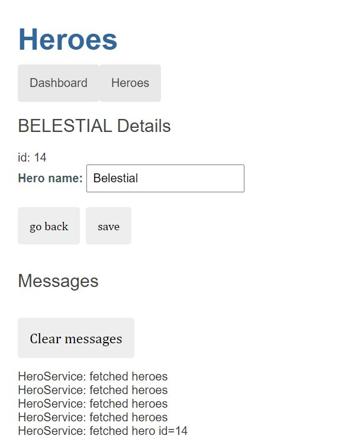

# AngularTourOfHeroes
 Angular Tutorial: Tour of Heroes application and tutorial
 [Tutorial page:](https://angular.io/tutorial/tour-of-heroes)
Simple web app which displays infos of your favourite heroes.

 # Topics
- Use Angular directives to show and hide elements and display lists of hero data.
- Create Angular components to display hero details and show an array of heroes.
- Use one-way data binding for read-only data.
- Add editable fields to update a model with two-way data binding.
- Bind component methods to user events, like keystrokes and clicks.
- Enable users to select a hero from a list and edit that hero in the details view.
- Format data with pipes.
- Create a shared service to assemble the heroes.
- Use routing to navigate among different views and their components.
- Use In-memory Web API to mock API calls

## Angular Info
This project was generated with [Angular CLI](https://github.com/angular/angular-cli) version 16.0.3.
### Development server

Run `ng serve` for a dev server. Navigate to `http://localhost:4200/`. The application will automatically reload if you change any of the source files.

#### Code scaffolding

Run `ng generate component component-name` to generate a new component. You can also use `ng generate directive|pipe|service|class|guard|interface|enum|module`.

### Build

Run `ng build` to build the project. The build artifacts will be stored in the `dist/` directory.

### Running unit tests

Run `ng test` to execute the unit tests via [Karma](https://karma-runner.github.io).

### Running end-to-end tests

Run `ng e2e` to execute the end-to-end tests via a platform of your choice. To use this command, you need to first add a package that implements end-to-end testing capabilities.

### Further help

To get more help on the Angular CLI use `ng help` or go check out the [Angular CLI Overview and Command Reference](https://angular.io/cli) page.
